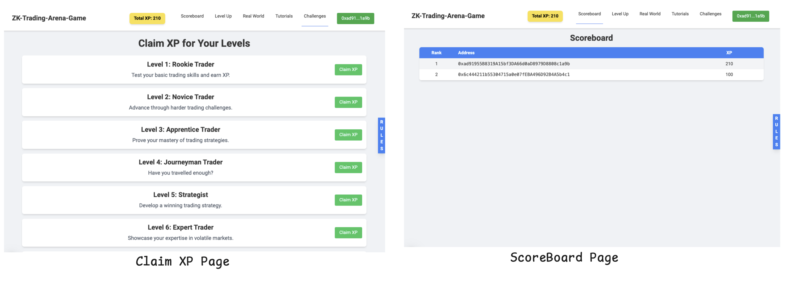

# ZK Trading Arena

<div style="display: flex; ">
  
</div>

### **Track:** Play

**Submission for:** EDU Chain Hackathon - Semester 2

---

## **Table of Contents**

1. **Introduction**
2. **Inspiration Behind ZKTradingArena**
3. **Workflow**
   - LevelUp Section
   - Real World Simulation Section
   - ClaimXP and Leaderboard Section
4. **Diagrams**
5. **Brief Overview of Technologies Used in ZKTradingArena**
   - 5.1 Zero Knowledge Research and Integration using Noir
   - 5.2 Solidity Smart Contracts and Foundry
   - 5.3 Next.js for Frontend Development
6. **How to Start with ZKTradingArena**
7. **What's Next for ZKTradingArena?**

---

## **1. Introduction**

**ZKTradingArena** is an interactive platform designed to make learning blockchain trading strategies fun, engaging, and practical. It gamifies the experience of learning trading strategies while integrating cutting-edge blockchain technologies like Zero Knowledge (ZK) proofs. This combination of educational simulation and gamification helps users understand decentralized finance (DeFi) concepts and trading mechanisms, while also enabling them to compete in a leaderboard-based trading arena.

One of the core innovations of ZKTradingArena is its ability to combine privacy with transparency. It **is a simple simulation game of real-world commodity trading. Through zero-knowledge proof technology, players can prove the authenticity and security of transaction results without revealing their trading strategies.**

```markdown
> In real market transactions, each trader or quantitative institution has its own trading strategy, and the quality of the strategy determines the amount of income. However, traders want to avoid leaks of their trading strategies because once widely known, such strategies become ineffective in a competitive market. To address this, ZKTradingArena allows players to prove their profitability to bystanders (such as private equity clients)without revealing critical details such as:

- Position status at each point in time.
- Cash and asset ratio.
- Trading frequency.
```


For example:

Alice and Bob are friends, and they like playing trading games. Bob is a veteran trader. He has his own trading strategy and consistently achieves good returns in the futures market. However, Alice is skeptical and thinks Bob might just be lucky or receiving advice from an expert. Alice wants Bob to demonstrate his trading capabilities in front of her but without revealing his strategy. Bob proposes the following solution:

1. Bob uses a computer that only performs transactions and has no external connectivity (e.g., no Google or WhatsApp).
2. Alice observes from a distance without viewing Bob’s screen but can see the account balance before and after each trade.
3. Bob demonstrates his trades multiple times. Even if a single trade involves an element of luck, repeating the behavior n times allows Alice to evaluate Bob’s skill using probability theory, much like backtesting an artificial intelligence model.

In the blockchain context, Bob represents the player of ZKTradingArena, while Alice is analogous to an explorer of a blockchain like Edu Chain. Bob only needs to prove his trading ability without exposing the underlying records of his trades, thanks to ZK proof technology.

---

## **2. Inspiration Behind ZKTradingArena**

The inspiration for ZKTradingArena stems from two core ideas:

1. **Democratizing Trading Education:** Traditional trading education lacks interactivity, making it difficult for learners to grasp complex concepts. ZKTradingArena bridges this gap by providing a real-world-like simulation with guided learning paths.
2. **Zero Knowledge Integration for Privacy:** We wanted to create an educational platform that protects users' trading strategies and data, fostering a safe and privacy-focused environment for experimentation.

---

## **3. Preview**

ZKTradingArena is divided into three key sections that ensure an engaging and educational experience:

### **Rules to play the game**

<div style="display: flex; justify-content: space-between;gap: 10px;">
  
</div>

### **LevelUp Section**

<div style="display: flex; justify-content: space-between;gap: 10px;">
  
  
</div>


- **Purpose:** Introduces users to the basics of DeFi trading, including liquidity provision, arbitrage, and market-making strategies.
- **Mechanics:**
  - Users complete guided tutorials and mini-challenges to level up their trading skills.
  - Challenges are integrated with ZK proofs to verify that users solve them without exposing sensitive data.

### **Real World Simulation Section**

<div style="display: flex; justify-content: space-between;gap: 10px;">
  
  
</div>

- **Purpose:** Simulates real-world DeFi trading scenarios, allowing users to apply learned strategies in a risk-free environment.
- **Mechanics:**
  - Users are provided with virtual tokens to practice trading strategies.
  - The simulation includes market volatility, fees, and dynamic liquidity changes to mimic real-world conditions.
  - ZK proofs ensure that trading performance is calculated fairly and without tampering.

### **ClaimXP and Leaderboard Section**

<div style="display: flex; justify-content: space-between;gap: 10px;">
  
  
</div>

- **Purpose:** Rewards users for their learning progress and trading achievements.
- **Mechanics:**
  - Users earn XP (Experience Points) for completing challenges and achieving milestones in simulations.
  - XP is recorded on the blockchain using smart contracts, ensuring transparency and immutability.
  - Leaderboards showcase top performers, creating a competitive and motivating environment.

---

## **4. Diagrams**

This section provides architectural and workflow diagrams to visually explain the inner workings of ZKTradingArena.

- **Workflow Diagram:** Explains the step-by-step user journey through LevelUp, Real World Simulation, and ClaimXP sections.
- <div style="display: flex; justify-content: space-between;">
  
</div>

---

## **5. Brief Overview of Technologies Used in ZKTradingArena**

### **5.1 Zero Knowledge Research and Integration using Noir**

- **Noir:** A domain-specific language for writing efficient ZK circuits.
- **Use Case in ZKTradingArena:** Noir is used to build ZK circuits for verifying trading challenges, ensuring users can prove success without exposing exact strategies.

### **5.2 Solidity Smart Contracts and Foundry**

- **Smart Contracts:** Enable recording XP, storing leaderboard data, and managing the trading simulation state securely on the blockchain.
- **Foundry:** A developer-first framework used for testing and deploying Solidity contracts efficiently.

### **5.3 Next.js for Frontend Development**

- **Why Next.js:** Its fast rendering capabilities and modular structure make it ideal for building an interactive and dynamic educational platform.
- **Frontend Features:** Includes a clean UI for tutorials, trading simulations, and leaderboard visualization.

---

## **6. How to Start with ZKTradingArena**

### **Prerequisites:**

- Node.js and npm/yarn installed.
- A wallet like MetaMask configured for the EDU Chain test network.

### **Steps:**

1. **Clone the Repository:**

   ```bash
   git clone https://github.com/Dwaipayan25/zk-trading-arena-game.git
   cd zk-trading-arena-game
   cd zk-trading-arena-game
   ```

2. **Install Dependencies:**

   ```bash
   npm install
   ```

3. **Run the Development Server:**

   ```bash
   npm run dev
   ```

4. **Access ZKTradingArena:**

   - Open your browser and navigate to `http://localhost:3000`.

---

## **7. What's Next for ZKTradingArena?**

- **Feature Expansion:**

  - Introduce advanced trading scenarios like leverage and options trading.
  - Add more comprehensive ZK circuits for new types of challenges.

- **Community Contributions:**

  - Open ZKTradingArena to community-driven strategy additions and educational content.
  - Hire individuals so people can get the top most content.

- **Mobile Support:**

  - Develop a mobile-friendly version for seamless access on the go.

---

ZKTradingArena aims to revolutionize blockchain trading education by combining fun, privacy, and transparency. Join us in building a community of skilled and responsible DeFi traders!

For more updates, follow us on Twitter: [@ZKTradingArena](https://twitter.com/ZKTradingArena)
